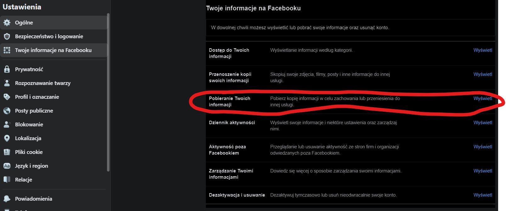
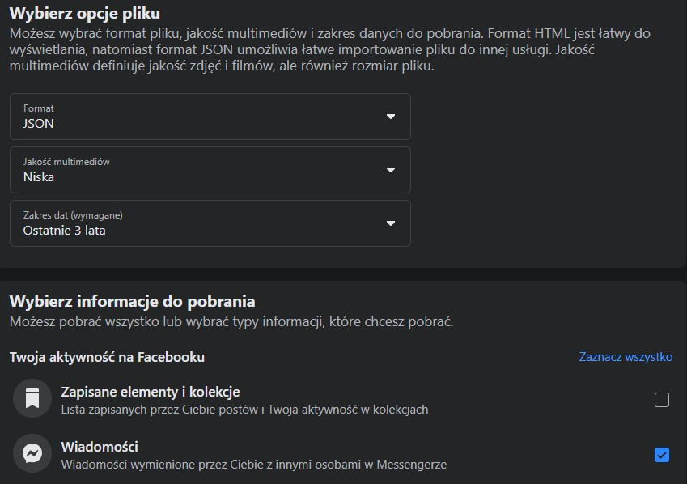

# Messenger data analysis

[App](https://messenger-analysis.herokuapp.com/)

Authors:

- [Mikołaj Gałkowski](https://github.com/galkowskim)
- [Laura Hoang](https://github.com/hoanganhlinh)
- [Wiktor Jakubowski](https://github.com/WJakubowsk)

## Data preparation

### Go to Settings on Facebook and download the data according to the images below. We recommend downloading up to 4 years of data.

Next, we put in extract the messages folder from the zip and remove everything from it except the `inbox` folder. In case we have two files 
zip we repeat the operation and name the messages folder so that their names differ. Next, in the folder **dataPreprocessing** we create a 
folder **messages** and put the `messages` folder / `messages` folders there (different names). We call the function from the script **data_preprocessing.py**.
giving in the arguments your name in a string (for example, "Mikołaj Gałkowski"). This way we get a ready-made csv'ke, which we can use
on page 